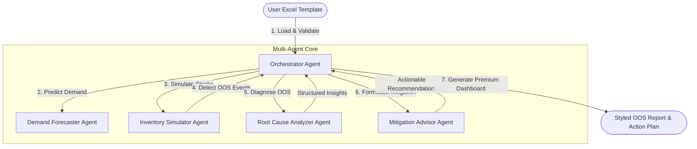

# StockSentinel 🛡️: Multi-Agent Supply Chain OOS Guard

StockSentinel is a highly modular, self-contained, and portable **Multi-Agent AI Framework** designed to predict Out-of-Stock (OOS) risks in last-mile Distribution Centers (DCs), diagnose their underlying root causes, and formulate actionable logistics mitigation recommendations.

The framework reads data directly from an **Excel input template** (making it perfect for copying directly to your office laptop to use with real-world ERP exports) and compiles all analytical findings and action plans into a **beautifully styled, executive-ready Excel report**.

---

## 🏗️ Multi-Agent Architecture

StockSentinel leverages a coordinated, cooperative multi-agent team orchestrated to optimize inventory integrity:



1. **Orchestrator Agent**: coordinates the data parsing pipeline, triggers simulations, routes detected stockouts to cognitive agents, and compiles the final styled spreadsheet dashboard.
2. **Demand Forecaster Agent**: Audits quantitative demand forecasts and applies qualitative adjustments (e.g. promotions, holidays, supplier capacity changes) using LLM reasoning.
3. **Inventory Simulator Agent**: Performs a daily mathematical trace of stock balances: $Stock_t = Stock_{t-1} + Receipts_t - Demand_t$. Flags exact OOS dates and determines risk severity.
4. **Root Cause Analyzer Agent**: Investigates OOS traces, lead times, safety stocks, and pending shipments to diagnose the primary and secondary causes (e.g. Supplier Lead-Time Delay, Promotional Spike, Low Reorder Point).
5. **Mitigation Advisor Agent**: Recommends logistics interventions (e.g. Expediting POs, Inter-DC stock transfers, Air Freight emergency POs) with estimated costs and operational checklists.

---

## 📂 Project Directory Structure

```
Out of Stock Agent/
├── .env.example            # Environment configuration template
├── README.md               # User manual and architecture guide
├── requirements.txt        # Python package dependencies
├── generate_template.py    # Generates a beautiful Excel template with realistic mock scenarios
├── run_analysis.py         # Main entry point to run the multi-agent analysis
├── debug_sheets.py         # Utility tool to verify Excel sheets
├── src/
│   ├── __init__.py
│   ├── config.py           # Config parser loading env variables
│   ├── orchestrator.py     # Coordinates the flow, calculations, and Excel writing
│   ├── agents/
│   │   ├── __init__.py
│   │   ├── base_agent.py   # Base class for LLM calls with retry logic
│   │   ├── demand_agent.py # Cognitive Demand Forecaster Agent
│   │   ├── inventory_agent.py # Daily Inventory Simulation Agent
│   │   ├── rca_agent.py    # Cognitive Root Cause Analyzer Agent
│   │   └── mitigation_agent.py # Cognitive Mitigation Advisor Agent
│   └── utils/
│       ├── __init__.py
│       └── excel_handler.py # High-quality openpyxl formatting engine
```

---

## ⚡ Quick Start

### 1. Install Dependencies
Open your terminal (PowerShell, Command Prompt, or Bash) in this project folder and run:
```bash
pip install -r requirements.txt
```

### 2. Generate the Excel Input Template
Run the generator script to create the initial Excel file pre-populated with realistic supply chain scenarios:
```bash
python generate_template.py
```
This creates `input_template.xlsx` in your directory, containing:
* **`SKU_Metadata`**: Standard product metadata including unit cost, price, and supplier lead times.
* **`Inventory_Status`**: Current stock levels, safety stocks, reorder points, and reorder quantities.
* **`Demand_Forecast`**: 30-day daily demand schedule.
* **`Supply_Pipeline`**: Outstanding purchase orders, expected delivery dates, and status.

### 3. Run the Multi-Agent Pipeline
You can run the predictive analysis immediately:
```bash
python run_analysis.py
```
This runs the entire forecasting, simulation, diagnostics, and recommendation pipeline.
It will output an executive styled Excel file named: **`oos_analysis_report.xlsx`**.

---

## 🔑 AI Cognitive Agent Configuration (OpenAI Key)

StockSentinel is built with **100% operational resilience**. It runs in two distinct modes:

1. **Deterministic Fallback Mode (Offline)**: If no OpenAI key is configured, StockSentinel executes the complete simulation and runs robust, pre-coded analytical heuristics to diagnose root causes and recommend actions. This is perfect for firewalled corporate environments or testing offline.
2. **Cognitive AI Mode (Online)**: When your OpenAI key is configured, the agents leverage LLMs (defaulting to `gpt-4o-mini` for high performance and low costs) to perform highly customized root-cause narrative reasoning, read semantic context (like promotional notes), and formulate bespoke mitigation steps.

To enable **Cognitive AI Mode**:
1. Copy the `.env.example` file and rename it to `.env`.
2. Open `.env` in a text editor and enter your OpenAI API key:
   ```env
   OPENAI_API_KEY=sk-proj-...
   ```
3. Save the file and run `python run_analysis.py`!

---

## 💼 Portability to your Office Laptop

To run this on your corporate machine with your actual business data:
1. **Zip and Transfer**: Zip the entire `Out of Stock Agent` folder and transfer it to your office laptop.
2. **Install Python & Packages**: Ensure Python is installed on your laptop, open a terminal in the folder, and run:
   ```bash
   pip install -r requirements.txt
   ```
3. **Populate your data**: Open `input_template.xlsx` in Excel, clear the mock rows (keeping the header names unchanged), and paste your real ERP/WMS data exports into:
   * `SKU_Metadata`
   * `Inventory_Status`
   * `Demand_Forecast` (30-day daily demand)
   * `Supply_Pipeline`
4. **Configure your Key (Optional)**: Setup your `.env` file if you have external internet/API access. If not, the deterministic fallback mode will run immediately, providing fully styled diagnostic reports without any internet connection!
5. **Run**:
   ```bash
   python run_analysis.py
   ```
6. **Review Dashboard**: Open `oos_analysis_report.xlsx` and leverage the color-coded executive dashboard to safeguard your supply chain!
